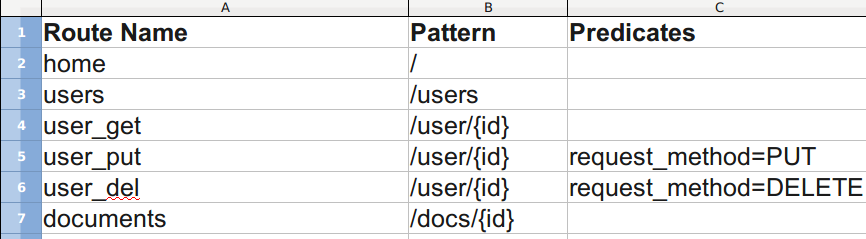
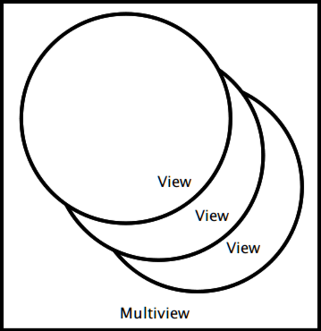
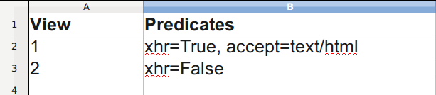

.. include:: <s5defs.txt>

Pyramid Views
=============

:Authors: Chris McDonough, Agendaless Consulting
:Date: 4/29/2011 (Pylons Minicon, SF)

..  footer:: Chris McDonough, Agendaless Consulting

View Callables
--------------

- View callables are the work horses of most web applications.  They compose
  the "front" of the server side of the application.

.. raw:: html

		<!--Our conversation-->
		

			

				Hi, here's a request.  Could I have a response?  BTW, I'm kinda 
        particular.
			

			

				Wow! I see all the conditions you put in there.  Let me
				dig around a little bit to find you the best answer.  OK, here's my best
				response, hope you like it!
			

		

		<!--End of conversation-->

WTView?
-------

.. image:: omg-wtf.jpg
   :align: center

- Definition of "view" is the same as Django's, Flask's, and Zope's.

- Dissimilar from Rails' and Pylons'.  Pyramid doesn't use "MVC" terminology
  but works the same.

View Callables
--------------

A Pyramid view callable is:

- A **function** (or any other object with a ``__call__`` method) that
  accepts a Request object and returns a Response object.

- *or* a **class** that accepts a Request object as an ``__init__`` argument
  and which also has a different method which accepts no arguments; that
  method returns a Response object.

A View Callable as Function
---------------------------

Below, ``aview`` is a simple view callable implemented as a **function**:

.. sourcecode:: python

   from pyramid.response import Response

   def aview(request):
       return Response('OK')

A View Callable as Instance
---------------------------

Below, ``aview`` is a simple view callable implemented as an **instance**:

.. sourcecode:: python

   from pyramid.response import Response

   class AViewFactory(object):
       def __call__(self, request):
           return Response('OK')

   aview = AViewFactory()

A View Callable as Class
------------------------

Below, ``aview`` is a simple view callable implemented as a **class**:

.. sourcecode:: python

   from pyramid.response import Response

   class aview(object):
       def __init__(self, request):
           self.request = request

       def __call__(self):
           return Response('OK')

View Class (Multiple Methods)
-----------------------------

Any method of a view class can return a response:

.. sourcecode:: python

   class aview(object):
       def __init__(self, request):
           self.request = request
       def ok(self):
           return Response('OK')
       def notok(self):
           return Response('Not OK')

View Declared!=Registered
-------------------------

- Typing in a view callable or a view class does not make it eligible
  to be considered for view execution.

- You need to *register* a view callable to make it eligible for view
  execution.

- View registration can be done imperatively or by invoking a ``scan``.

View Registration (Imperative)
------------------------------

.. sourcecode:: python

   from pyramid.config import Configurator
   from pyramid.response import Response

   def aview(request):
       return Response('OK')

   if __name__ == '__main__':
      config = Configurator()
      config.add_route('home', '/')
      config.add_view(aview, route_name='home')

View Class (Multiple Methods)
-----------------------------

.. sourcecode:: python

   class aview(object):
       def __init__(self, request):
           self.request = request
       def ok_view(self):return Response('OK')
       def notok_view(self):return Response('NotOK')
   if __name__ == '__main__': # ...
       config.add_route('ok', '/ok')
       config.add_route('notok', '/notok')
       config.add_view(aview,route_name='ok',
                       attr='ok_view')
       config.add_view(aview,route_name='notok',
                       attr='notok_view')

View Class (Multiple Methods)
-----------------------------

- When the view is a class and the ``attr`` argument is *not* passed to
  ``add_view``, the ``__call__`` method of the class is assumed to be
  something that returns a response.

- When ``attr`` *is*, passed, however, it names the method of the
  class you like to behave as the response generating callable.

Declarative View Registration
-----------------------------

- Reduces boilerplate.

- Puts view configuration parameters nearer to view callable itself
  ("locality of reference").

Register View Declaratively
---------------------------

.. sourcecode:: python

   from pyramid.view import view_config
   from pyramid.response import Response

   @view_config(route_name='home')
   def aview(request):
       return Response('OK')

   if __name__ == '__main__':
       # ...
       config.add_route('home', '/')
       config.scan('__main__')

Register Class Declaratively
----------------------------

.. sourcecode:: python

   @view_config(route_name='home')
   class aview(object):
       def __init__(self, request):
           self.request = request
       def __call__(self):
           return Response('OK')

   if __name__ == '__main__':
       # ...
       config.add_route('home', '/')
       config.scan('__main__')

Register Method Declaratively
-----------------------------

.. sourcecode:: python

   class aview(object):
       def __init__(self, request):
           self.request = request
       @view_config(route_name='ok')
       def ok(self): return Response('OK')
       @view_config(route_name='notok')
       def notok(self): return Response('Not OK')
   if __name__ == '__main__':
       # ...
       config.add_route('ok', '/ok')
       config.add_route('notok', '/not_ok')
       config.scan('__main__')

Impact of **view_config**
-------------------------

- ``view_config`` *only* marks view callables as registerable during a scan.
  It is a passthrough that just marks the callable so a later scan
  can find it.

- A derivation of the view callable is registered during a scan.

- When you import the decorated callable for testing purposes or other
  direct interaction, it won't behave any differently than it would if the
  decorator was not attached.

View Configuration
------------------

- View configuration is the set of arguments passed to ``add_view`` or
  ``view_config``. 

- There are many arguments.  The more arguments used, the more specific the
  scenario must be in order for the view to be executed.

- We've seen one named ``route_name``.  This argument associates the view
  with a *route* defined by ``add_route``.

View Lookup/Execution
---------------------

Pyramid "router" orchestrates view lookup and execution.  

Router Responsibilities
-----------------------

- The router is invoked when a WSGI request enters the application. 

- Developers usually don't interact with the router, unless they're creating
  a functional test.

Router Responsibilities
-----------------------

The router (among other things) is responsible for these steps:

- Create a request.

- Look for a matching route.

- Find a "context" (used for security).

- Using the context and the request, find a view callable.

- Invoke the view callable.

Router Timeline
---------------

- A new Request object is created using the **request factory**.

Router Timeline (2)
-------------------

- We look for a matching route by **iterating** over the existing routes **in
  insertion order**.  Some routes have predicates.  The first route in
  insertion order that matches all predicates "wins".

Router Timeline (3)
-------------------

- If we find a matching route, we **mark the request** as matched.

Router Timeline (4)
-------------------

- If the matched route has a **context factory**, we use that instead of the
  **global context factory**.

- We use the context factory to derive a context.  The context is used for
  security checking.

Router Timeline (5)
-------------------

- We look up a view based on the request and the context.

.. raw:: html

		<!--Our conversation-->
		

			

				Hi, here's a request and a context.  Could I have a view callable?
			

			

        Yep, here's one that matches all the conditions of the request and
        the context.
			

		

		<!--End of conversation-->

Router Timeline (6)
-------------------

- The view returned might be a "multiview".

Router Timeline (7)
--------------------

- A multiview is a group of views that share the same context type and
  request type.  Each concrete view that is part of a multiview differs only
  by the predicates it possesses.

- Predicates are checked to find "the best" concrete view that is part of the
  multiview.

Router Timeline (7)
-------------------

- We call a derived function that represents the view using the request.

.. sourcecode:: python

   from pyramid.response import Response

   def aview(request):
       return Response('OK')

   def derived_view(request):
       # ... do security checking using request and 
       # request.context ..
       return aview(request)

Router Timeline (8)
-------------------

- If the current user is permitted to execute the view, it will return a
  Response.

- Otherwise, the user will receive an Unauthorized response from the
  framework.

Denouement
-----------

- Pyramid view lookup is extremely flexible.

- Built-in security features make it easy to lock down.

- "Traversal", a separate way of mapping views to URLs, is an alternative;
  not covered here.

Question Time
--------------

- Please ask questions!
